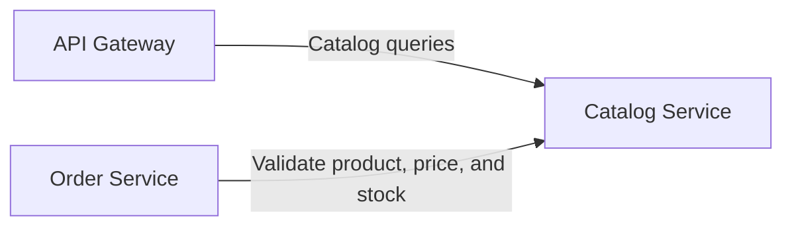

# NexusCart Catalog Service

The Catalog Service is a read-only FastAPI application that owns product
descriptions, VND prices, available stock, and presentation accents for the
NexusCart storefront.

## ✨ Highlights

- Python 3.13, FastAPI, Uvicorn, and Pydantic.
- Deterministic catalog data for five products.
- Product list and lookup endpoints under `/api/v1/products`.
- Interactive OpenAPI documentation at `/docs`.
- End-to-end `X-Request-ID` propagation and a shared JSON error shape.
- Versioned health reporting through `GET /health`.
- Small non-root container image.

## 🧭 Service Context



Clients reach the catalog through the API Gateway. The Order Service calls the
Catalog Service directly and uses its current product snapshot to calculate
line totals.

## 🔌 API

| Method | Path | Success | Description |
|---|---|---:|---|
| `GET` | `/health` | `200` | Service identity and deployed version |
| `GET` | `/api/v1/products` | `200` | All products in an `items` array |
| `GET` | `/api/v1/products/{id}` | `200` | One product by ID |
| `GET` | `/docs` | `200` | Direct-service OpenAPI UI |

An unknown product returns `404 PRODUCT_NOT_FOUND`. The API Gateway does not
publish `/docs`; open it on the direct service port during local development.

## 🧪 API Examples

```bash
curl -i \
  -H "X-Request-ID: docs-product-001" \
  http://localhost:8082/api/v1/products/prd-001
```

```json
{
  "id": "prd-001",
  "name": "Mechanical Keyboard",
  "description": "Compact 75% layout with tactile switches.",
  "price": 1290000,
  "currency": "VND",
  "stock": 10,
  "accent": "amber"
}
```

A missing product uses the shared error contract:

```json
{
  "error": {
    "code": "PRODUCT_NOT_FOUND",
    "message": "Product prd-999 does not exist",
    "requestId": "docs-product-001"
  }
}
```

The response also includes the request ID in the `X-Request-ID` header.

## 🚀 Quick Start

### Prerequisites

- Python 3.13.

```bash
python -m venv .venv
```

Activate it with `..venvScriptsActivate.ps1` in PowerShell or
`source .venv/bin/activate` in Bash, then run:

```bash
python -m pip install -r requirements-dev.txt
python -m uvicorn app.main:app --reload --port 8082
```

Open the API at <http://localhost:8082> and the OpenAPI UI at
<http://localhost:8082/docs>.

## 📦 Seed Catalog

| ID | Product | Price | Stock |
|---|---|---:|---:|
| `prd-001` | Mechanical Keyboard | 1,290,000 VND | 10 |
| `prd-002` | Studio Headphones | 2,150,000 VND | 7 |
| `prd-003` | Desk Light Mini | 780,000 VND | 14 |
| `prd-004` | Everyday Backpack | 1,680,000 VND | 5 |
| `prd-005` | Ceramic Travel Mug | 420,000 VND | 20 |

No mutation endpoint or database is used. Restarting the service restores this
same catalog.

## ⚙️ Runtime Configuration

| Variable | Default | Purpose |
|---|---|---|
| `APP_VERSION` | `1.0.0` | Application and health endpoint version |

The development port is selected by the Uvicorn `--port` argument. The
container listens on `8082`.

## ✅ Quality Gates

```bash
python -m pip install -r requirements-dev.txt
python -m pytest
```

The tests cover list and lookup behavior, health metadata, missing-product
errors, and request ID propagation.

## 🐳 Container Image

```bash
docker build -t nexuscart-catalog-service:local .
docker run --rm -p 8082:8082 \
  -e APP_VERSION=local \
  nexuscart-catalog-service:local
```

The final image runs Uvicorn as the unprivileged `app` user.

## 🔁 CI/CD

`azure-pipelines.yml` owns this repository's variables and composes the local
`pipelines/stages/ci.yml`, `deploy-dev.yml`, and `deploy-prod.yml` stage
templates. It extends only the minimal shared contract in the GitHub `devops`
repository.

- Every branch installs development dependencies, runs Pytest, builds the
  image, and scans it with Trivy.
- `main` publishes an immutable `$(Build.BuildId)` image to Azure Container
  Registry and promotes it through DEV and PROD with Helm verification.

## 📁 Repository Structure

```text
catalog-service/
├── app/
│   ├── errors.py           # Common API error contract
│   ├── main.py             # FastAPI routes and middleware
│   ├── models.py           # Pydantic response models
│   └── repository.py       # Seeded product repository
├── tests/test_api.py       # API tests
├── pipelines/stages/
│   ├── ci.yml              # Test, build, scan, and ACR push
│   ├── deploy-dev.yml      # DEV deploy and verification
│   └── deploy-prod.yml     # Approval, PROD deploy, and verification
├── azure-pipelines.yml
├── Dockerfile
├── pyproject.toml
├── requirements.txt
└── requirements-dev.txt
```
